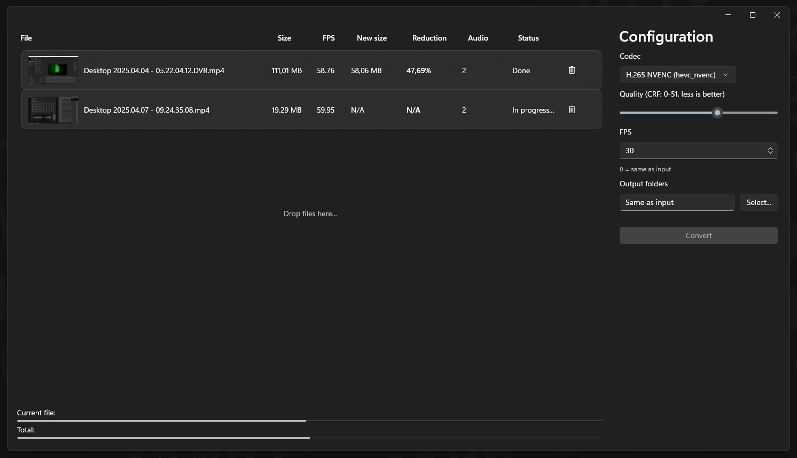

# Magnesium

Magnesium is a fast FFMPEG based video converter with a simple GUI. Designed for optimizing my collection of ShadowPlay screen recordings. 

Its existence is due solely to my desire to understand how the WinUi3 works.

Highly inspired by [Caesium by SaeraSoft](https://saerasoft.com/caesium/#contacts).

## Features

- Fast conversion using FFMPEG
- Simple and intuitive GUI on modern WinUi3 library
- Batch processing of multiple files
- Customizable output settings
- Supports various input and output formats
- Drag and drop functionality
- Progress bar for tracking conversion status

## Requirements

- FFMPEG must be installed and accessible via the system PATH.

## License

This project is licensed under the MIT License - see the [LICENSE](LICENSE.txt) file for details.
